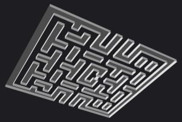
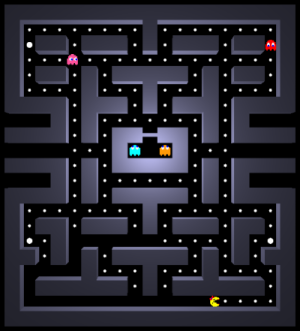
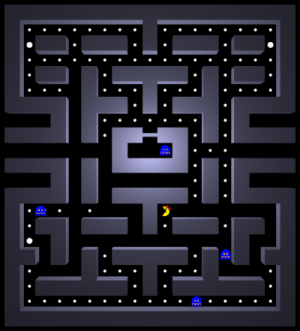

# Controls
- `Left/Right/Up/Down arrow` - movement.

  
  

The feeling from the game should be similar as you would have from playing the 1980's version. Just a speed is litle bit higher.

# Features
- You can move around.
- You can be eaten by the ghosts.
- You can eat energizer (the big dot) and hunt the ghosts.
- The game has different stages (ghosts can be chasing **Pac-Man** or running away).
- 
# Additional information
World is generated from a 2D map in a form of separated cubes. Simple optimization to connect adjanced cubes is done to minimaze number of the triangles and eliminate problems such as z-fighting. You can see it here from the bottom view:

  
  

Result is fully 3D world with dynamic point light inhabited by 2D billboards. Speed is locked to 60 PFS.

# Screenshots

  
  &nbsp; &nbsp; &nbsp; &nbsp; &nbsp; &nbsp; &nbsp; 

